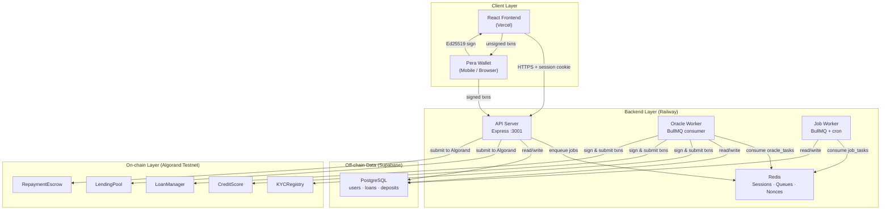
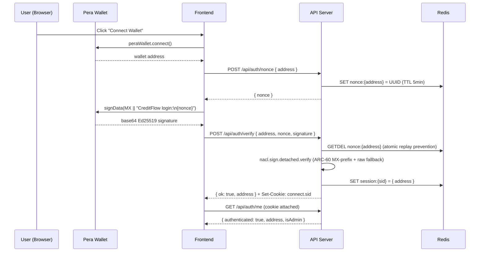
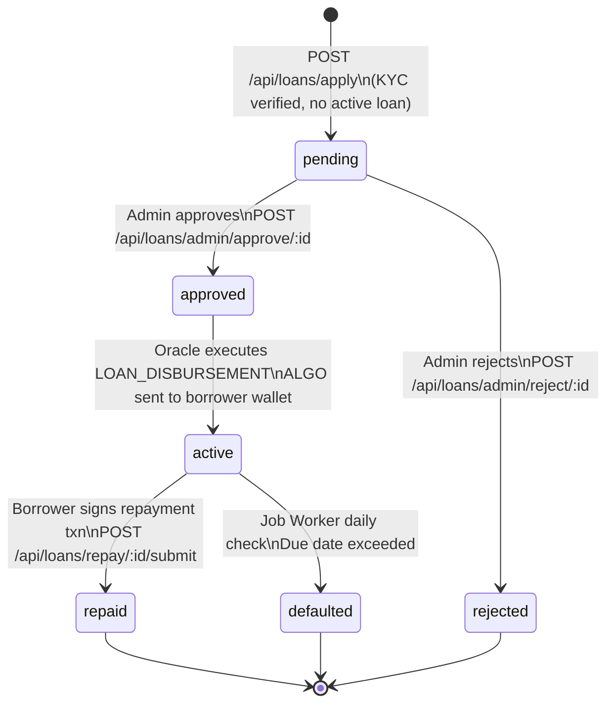
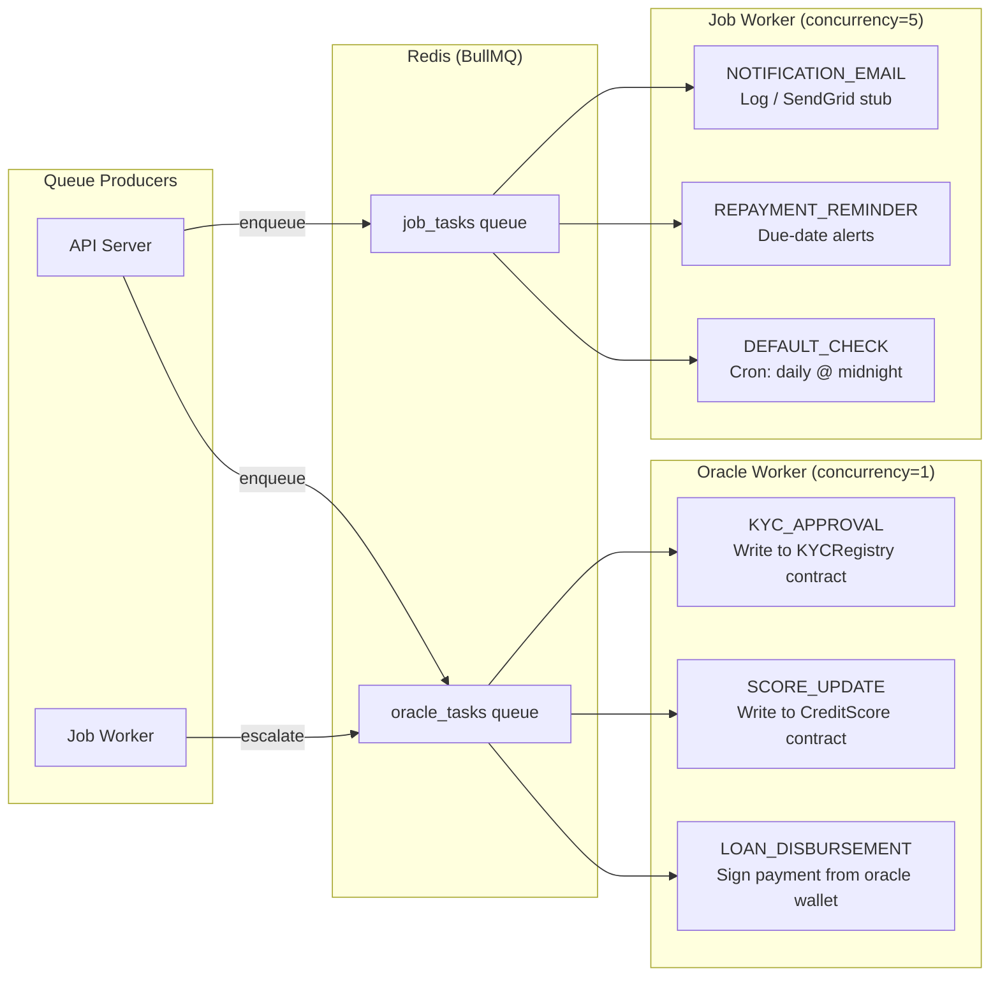
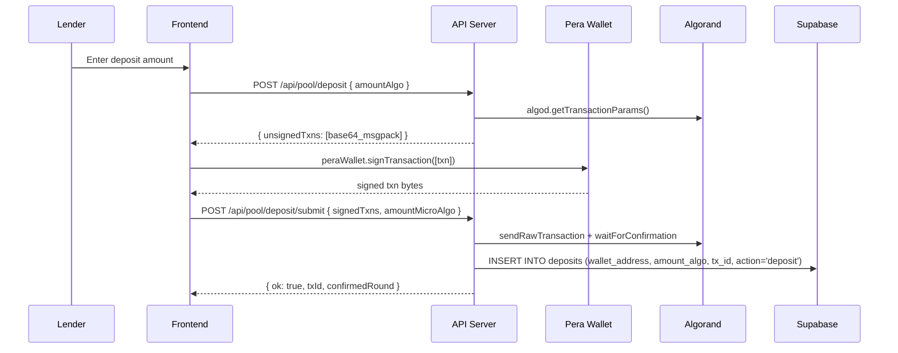
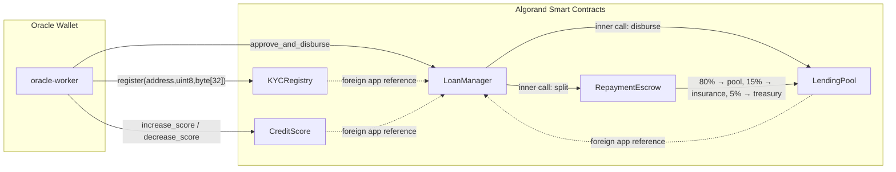
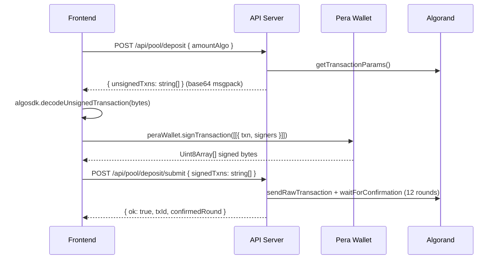
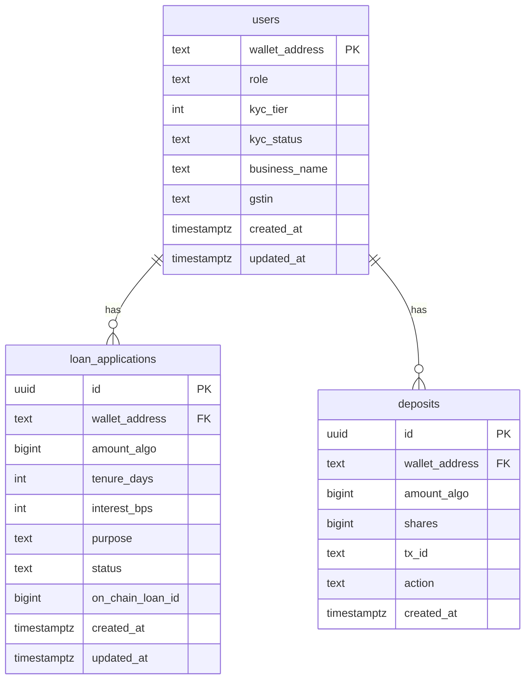
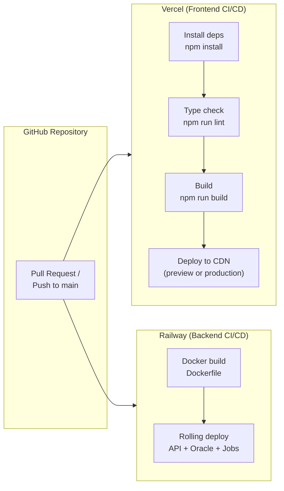

# Credencia — Decentralized Lending Protocol on Algorand

**[Live Demo: credencia-platform.vercel.app](https://credencia-platform.vercel.app)**

Credencia (formerly Cadencia CreditFlow) is a decentralised MSME lending platform built on the Algorand blockchain. It combines five interconnected on-chain smart contracts with an off-chain Node.js backend and a React/Vite frontend to deliver collateral-free credit, yield-bearing liquidity pools, and cryptographically verifiable credit scoring.

> **Network:** Algorand Testnet
> **Stack:** AlgoPy · Node.js · Express · React · Vite · Supabase · Redis · Docker · Railway · Vercel

---

## Table of Contents

- [Architecture](#architecture)
- [Repository Structure](#repository-structure)
- [Smart Contracts](#smart-contracts)
- [Backend](#backend)
- [Frontend](#frontend)
- [Database](#database)
- [Docker](#docker)
- [Deployment](#deployment)
- [Environment Variables](#environment-variables)
- [API Reference](#api-reference)
- [Tech Stack](#tech-stack)

---

## Architecture

### System Overview



### Authentication Flow



### Loan Lifecycle



### Oracle Job Queue Architecture



### Deposit and Withdrawal Flow



---

## Repository Structure

```
credencia/
├── backend/
│   ├── backend/                    # Node.js backend monorepo
│   │   ├── api/src/
│   │   │   ├── server.js           # Express entry point
│   │   │   ├── config.js           # Centralised env config
│   │   │   ├── redis.js            # ioredis singleton
│   │   │   ├── queues.js           # BullMQ queue definitions
│   │   │   ├── supabase.js         # Supabase client
│   │   │   ├── algorand.js         # algod client factory
│   │   │   ├── middleware/
│   │   │   │   └── auth.js         # requireAuth, requireAdmin
│   │   │   └── routes/
│   │   │       ├── auth.js         # Nonce-challenge wallet auth
│   │   │       ├── kyc.js          # KYC submit/approve/reject
│   │   │       ├── loans.js        # Loan lifecycle endpoints
│   │   │       └── pool.js         # Deposit/withdraw/stats/score
│   │   ├── oracle-worker/src/
│   │   │   └── oracle.js           # BullMQ worker: signs Algorand txns
│   │   ├── job-worker/src/
│   │   │   └── jobs.js             # BullMQ worker: cron, notifications
│   │   ├── supabase/migrations/
│   │   │   ├── 001_initial_schema.sql
│   │   │   └── 002_phase2_additions.sql
│   │   ├── Dockerfile
│   │   ├── railway.toml
│   │   └── package.json
│   ├── contracts/
│   │   └── cadencia/
│   │       ├── KYCRegistry/        # AlgoPy source + compiled TEAL + ARC-56
│   │       ├── CreditScore/
│   │       ├── LendingPool/
│   │       ├── LoanManager/
│   │       └── RepaymentEscrow/
│   ├── scripts/
│   │   ├── deploy.js               # Deploy all 5 contracts to testnet
│   │   └── redeploy-pool-loan.js   # Redeploy LendingPool + LoanManager only
│   └── docker-compose.yml
└── frontend/
    ├── src/
    │   ├── pages/
    │   │   ├── Landing.tsx
    │   │   ├── app/
    │   │   │   ├── Dashboard.tsx
    │   │   │   ├── Kyc.tsx
    │   │   │   ├── Borrow.tsx
    │   │   │   ├── Lend.tsx
    │   │   │   └── Score.tsx
    │   │   └── admin/
    │   │       ├── AdminKyc.tsx
    │   │       └── AdminLoans.tsx
    │   ├── components/
    │   │   ├── AppLayout.tsx
    │   │   ├── WalletModal.tsx
    │   │   └── ui/                 # shadcn/ui primitives
    │   ├── hooks/
    │   │   └── useAlgoSigner.ts    # Build → sign → submit pipeline
    │   ├── lib/
    │   │   ├── api.ts              # Axios instance (session cookie)
    │   │   ├── peraWallet.ts       # Pera singleton
    │   │   ├── types.ts
    │   │   └── format.ts
    │   └── store/
    │       └── auth.ts             # Zustand auth store
    ├── Dockerfile                  # Multi-stage: Vite build → nginx
    ├── nginx.conf                  # SPA routing + gzip + security headers
    └── package.json
```

---

## Smart Contracts

Five interconnected Algorand contracts written in **AlgoPy (PuyaPy)**:

| Contract | Entry Point | Purpose |
|----------|-------------|---------|
| `KYCRegistry` | `kyc_registry.py` | Oracle-gated on-chain KYC status, box storage per wallet |
| `CreditScore` | `credit_score.py` | Borrower credit scores (0–1000), box storage per wallet |
| `LendingPool` | `lending_pool.py` | ALGO liquidity pool, share minting, utilisation cap |
| `LoanManager` | `loan_manager.py` | Loan records in box storage, ARC-4 state machine |
| `RepaymentEscrow` | `repayment_escrow.py` | 80/15/5 repayment split: pool / insurance / treasury |

### Contract Interaction Map



### Compile Contracts

```bash
cd backend/contracts
algokit compile py cadencia/kyc_registry.py
algokit compile py cadencia/credit_score.py
algokit compile py cadencia/lending_pool.py
algokit compile py cadencia/loan_manager.py
algokit compile py cadencia/repayment_escrow.py
```

### Deploy Contracts

```bash
cd backend/scripts
node deploy.js
# Reads ORACLE_MNEMONIC from backend/backend/.env
# Deploys all 5 contracts and auto-updates .env with the new App IDs
```

---

## Backend

Three Node.js processes sharing a single `.env` and Redis instance:

| Process | Entry Point | Role |
|---------|-------------|------|
| `api` | `backend/api/src/server.js` | REST API — wallet auth, KYC, loans, pool stats |
| `oracle` | `backend/oracle-worker/src/oracle.js` | Signs and submits Algorand transactions (concurrency=1) |
| `jobs` | `backend/job-worker/src/jobs.js` | Background cron — default check, reminders |

### Prerequisites

- Node.js 18+
- Redis (`docker run -p 6379:6379 redis:7-alpine`)
- Supabase project
- `.env` file (see [Environment Variables](#environment-variables))

### Run Locally

```bash
cd backend/backend
npm install

# All 3 processes concurrently (recommended)
npm run dev:all

# Or individually
npm run api      # Terminal 1 — API on :3001
npm run oracle   # Terminal 2 — Oracle worker
npm run jobs     # Terminal 3 — Job worker
```

### Session and Cookie Design

The API uses **Redis-backed Express sessions** (`connect-redis` + `ioredis`). Sessions are written on successful wallet signature verification and attached to subsequent requests via an `httpOnly` cookie (`connect.sid`).

In production, the cookie uses `sameSite: 'none'` and `secure: true` to allow cross-origin requests from Vercel to Railway. CORS is handled by an allowlist driven by the `FRONTEND_URLS` environment variable (comma-separated).

---

## Frontend

React 18 · Vite · TypeScript · Tailwind CSS · shadcn/ui · Zustand · TanStack Query · Pera Wallet

### Prerequisites

- Node.js 18+
- `.env` file inside `frontend/`:

```env
VITE_API_URL=http://localhost:3001
VITE_LENDING_POOL_APP_ID=<your_app_id>
```

### Run Locally

```bash
cd frontend
npm install
npm run dev        # Dev server on http://localhost:8080
npm run build      # Production bundle to dist/
npm run test       # Vitest unit tests
```

### Transaction Signing Pipeline

All on-chain interactions follow a three-step pattern handled by `useAlgoSigner`:



---

## Database

Credencia uses **Supabase (PostgreSQL)** for off-chain state. Row-Level Security is enabled on all tables; the backend uses the service-role key to bypass RLS.

### Schema



### Run Migrations

```bash
# Via Supabase CLI
supabase db push

# Or paste manually in the Supabase SQL editor
# backend/backend/supabase/migrations/001_initial_schema.sql
# backend/backend/supabase/migrations/002_phase2_additions.sql
```

---

## Docker

The `docker-compose.yml` inside `backend/` orchestrates all services.

```
Services:
  redis          Redis 7 Alpine       (queues, nonces, sessions)
  api            Express REST API     :3001
  oracle         Oracle Worker        (no public port)
  jobs           Job Worker           (no public port)
  frontend-dev   Vite HMR dev server  :8080   [profile: dev]
  frontend       nginx production     :80     [profile: prod]
```

### Start Dev Stack

```bash
cd backend
docker compose --profile dev up --build
```

### Start Production Stack

```bash
cd backend
docker compose --profile prod up --build
```

> Ensure all required environment variables are set in `backend/backend/.env` before starting.

---

## Deployment

### Infrastructure Map

| Service | Platform | Root Path | Start Command |
|---------|----------|-----------|---------------|
| Frontend | Vercel | `frontend/` | `npm run build` (static) |
| API Server | Railway | `backend/backend/` | `node api/src/server.js` |
| Oracle Worker | Railway | `backend/backend/` | `node oracle-worker/src/oracle.js` |
| Job Worker | Railway | `backend/backend/` | `node job-worker/src/jobs.js` |
| Redis | Railway (managed add-on) | — | auto |
| Database | Supabase (managed) | — | auto |
| Smart Contracts | Algorand Testnet | — | deployed via `deploy.js` |

### CI/CD Pipeline



### Railway Setup

1. Create a Railway project and connect the GitHub repository.
2. Add a **Redis** database add-on. Copy the internal `REDIS_URL`.
3. Create three services from the same repo, each with `backend/backend` as root:
   - **API**: start command `node api/src/server.js`, port `3001`, health check `/api/health`
   - **Oracle**: start command `node oracle-worker/src/oracle.js`
   - **Jobs**: start command `node job-worker/src/jobs.js`
4. Set environment variables on all three services (see below).

### Vercel Setup

1. Import the GitHub repository into Vercel.
2. Set **Root Directory** to `frontend`.
3. Set **Framework Preset** to Vite.
4. Set the `VITE_API_URL` environment variable to the Railway API service URL.
5. Deploy.

---

## Environment Variables

### Backend (`backend/backend/.env`)

| Variable | Required | Description |
|----------|----------|-------------|
| `SESSION_SECRET` | Yes | 64-char hex secret — `openssl rand -hex 32` |
| `ORACLE_MNEMONIC` | Yes | 25-word Algorand mnemonic for the oracle wallet |
| `SUPABASE_URL` | Yes | Supabase project URL |
| `SUPABASE_ANON_KEY` | Yes | Supabase anon key |
| `SUPABASE_SERVICE_KEY` | Yes | Supabase service-role key (bypasses RLS) |
| `REDIS_URL` | Yes | Redis connection string (use `${{REDIS_URL}}` on Railway) |
| `KYC_REGISTRY_APP_ID` | Yes | Deployed KYCRegistry app ID |
| `CREDIT_SCORE_APP_ID` | Yes | Deployed CreditScore app ID |
| `LENDING_POOL_APP_ID` | Yes | Deployed LendingPool app ID |
| `LOAN_MANAGER_APP_ID` | Yes | Deployed LoanManager app ID |
| `REPAYMENT_ESCROW_APP_ID` | Yes | Deployed RepaymentEscrow app ID |
| `ADMIN_ADDRESSES` | Yes | Comma-separated admin wallet addresses |
| `PLATFORM_WALLET` | Yes | Oracle wallet address (receives repayments) |
| `FRONTEND_URLS` | Yes | Comma-separated allowed CORS origins |
| `NODE_ENV` | Yes | `production` on Railway |
| `MOCK_KYC` | No | `true` to auto-approve KYC (development only) |
| `PORT` | No | API port (default: `3001`) |
| `ALGORAND_NETWORK` | No | `testnet` or `mainnet` (default: `testnet`) |
| `ALGOD_SERVER` | No | Algod endpoint (default: algonode testnet) |
| `INDEXER_SERVER` | No | Indexer endpoint (default: algonode testnet) |

### Frontend (`frontend/.env`)

| Variable | Required | Description |
|----------|----------|-------------|
| `VITE_API_URL` | Yes | Backend API base URL (no trailing slash) |
| `VITE_LENDING_POOL_APP_ID` | Yes | LendingPool app ID for on-chain reads |
| `VITE_NETWORK` | No | `testnet` or `mainnet` |
| `VITE_ALGOD_SERVER` | No | Algod endpoint for frontend direct calls |
| `VITE_KYC_REGISTRY_APP_ID` | No | KYCRegistry app ID |
| `VITE_CREDIT_SCORE_APP_ID` | No | CreditScore app ID |
| `VITE_LOAN_MANAGER_APP_ID` | No | LoanManager app ID |
| `VITE_REPAYMENT_ESCROW_APP_ID` | No | RepaymentEscrow app ID |
| `VITE_WC_PROJECT_ID` | No | WalletConnect project ID |

> Never commit `.env` files. Both are excluded by `.gitignore`.

---

## API Reference

### Authentication

| Method | Route | Auth | Description |
|--------|-------|------|-------------|
| POST | `/api/auth/nonce` | None | Issue a one-time nonce for a wallet address |
| POST | `/api/auth/verify` | None | Verify Ed25519 signature, create session cookie |
| POST | `/api/auth/logout` | Session | Destroy session |
| GET | `/api/auth/me` | Session | Return current session address and admin flag |

### KYC

| Method | Route | Auth | Description |
|--------|-------|------|-------------|
| POST | `/api/kyc/submit` | Session | Submit KYC form (business name, GSTIN, role) |
| GET | `/api/kyc/status/:address` | None | Poll KYC verification status |
| GET | `/api/kyc/admin/pending` | Admin | List all pending KYC submissions |
| POST | `/api/kyc/admin/approve` | Admin | Approve KYC, enqueue oracle write |
| POST | `/api/kyc/admin/reject` | Admin | Reject KYC submission |

### Loans

| Method | Route | Auth | Description |
|--------|-------|------|-------------|
| GET | `/api/loans/my` | Session | List own loan applications |
| POST | `/api/loans/apply` | Session | Submit a loan application |
| POST | `/api/loans/repay/:id` | Session | Build unsigned repayment transaction |
| POST | `/api/loans/repay/:id/submit` | Session | Submit signed repayment transaction |
| GET | `/api/loans/admin/pending` | Admin | List all pending loan applications |
| GET | `/api/loans/admin/all` | Admin | Full loan history with pagination |
| POST | `/api/loans/admin/approve/:id` | Admin | Approve loan, enqueue disbursement |
| POST | `/api/loans/admin/reject/:id` | Admin | Reject loan application |

### Pool

| Method | Route | Auth | Description |
|--------|-------|------|-------------|
| GET | `/api/pool/stats` | None | TVL, utilisation, available liquidity |
| GET | `/api/pool/score/:address` | None | Credit score for any wallet address |
| POST | `/api/pool/deposit` | Session | Build unsigned deposit transaction |
| POST | `/api/pool/deposit/submit` | Session | Submit signed deposit transaction |
| POST | `/api/pool/withdraw` | Session | Oracle-signed direct withdrawal |
| GET | `/api/pool/my-position` | Session | Lender deposit history and net position |

### Health

| Method | Route | Auth | Description |
|--------|-------|------|-------------|
| GET | `/api/health` | None | Service health, network, feature flags |

---

## Tech Stack

| Layer | Technology |
|-------|-----------|
| Blockchain | Algorand (Testnet) |
| Smart Contracts | AlgoPy (PuyaPy) |
| Backend | Node.js 22 · Express 4 · BullMQ 5 |
| Session Store | Redis 7 (ioredis + connect-redis) |
| Database | Supabase (PostgreSQL) |
| Wallet Auth | Ed25519 · ARC-60 (Pera MX-prefix) · tweetnacl |
| Frontend | React 18 · Vite 5 · TypeScript 5 |
| UI Components | shadcn/ui · Tailwind CSS 3 · Radix UI |
| State Management | Zustand 5 · TanStack Query 5 |
| Wallet | Pera Wallet (`@perawallet/connect`) |
| Containers | Docker · nginx |
| Frontend Hosting | Vercel |
| Backend Hosting | Railway |

---

## License

MIT &copy; Team Credencia
